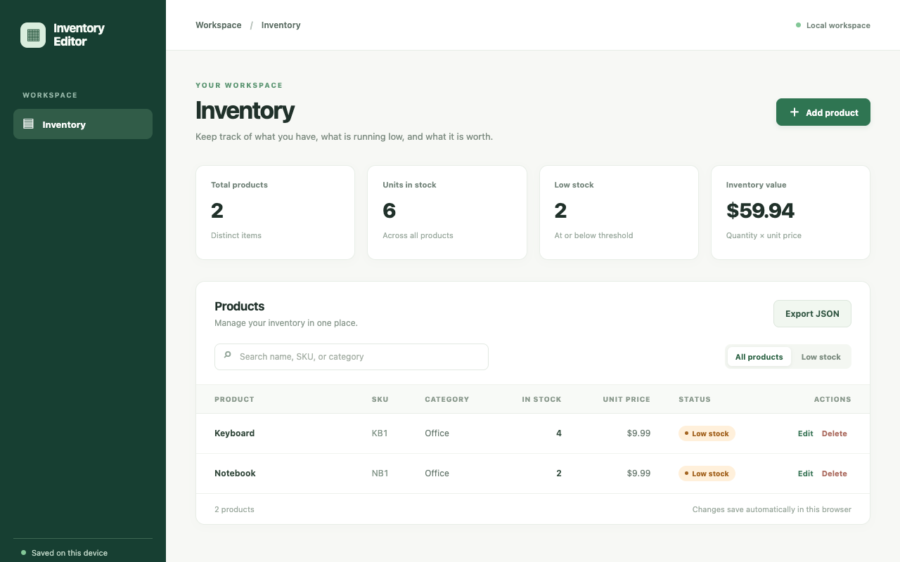
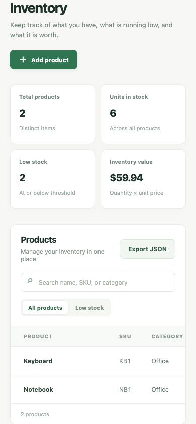

# Inventory Editor (archived)

Inventory management is now integrated into [Risa](https://github.com/TheArchitect71/Risa/tree/chore/dependency-refresh-2026-09). This standalone repository is retained as a read-only historical reference.

A browser-based inventory tracker for managing products, stock levels, and inventory value. It stores your records locally in the browser and needs no account, server API, or database.

## What you can do

- Add, edit, and delete products with names, SKUs, categories, quantities, and prices.
- Search products and filter low-stock items.
- View product counts, total units, and inventory value.
- Export inventory as JSON.

## Preview



Captured from the running application on September 30, 2026. Any sample records shown are demonstration or isolated test data, not data included with a fresh installation.

<details>
<summary>Mobile view</summary>



</details>

## Run locally

Use the Node version in `.nvmrc` (currently 26.10.0) and npm. Run these commands from the repository root.

```sh
nvm use  # if you manage Node with nvm
npm ci
npm start
```

Open [http://127.0.0.1:5173](http://127.0.0.1:5173). Keep the server in the foreground; stop it with **Ctrl+C**.

## Current scope

Inventory belongs to the browser and origin where it was saved. Keep the same hostname and port to access existing records; clearing browser storage removes them. Current Angular source is in `src/`; `app/` and `legacy-angular6/` preserve earlier implementations.

Risa includes an integrated Inventory page for its shop products. Existing standalone records remain in the original browser’s local storage and do not automatically transfer to Risa. The archived source can be cloned and run at the same hostname and port to export those records as JSON.

## Development

```sh
npm run build
npm run typecheck
npm test -- --browsers=ChromeHeadless
```

Browser tests require Chrome or Chromium; set `CHROME_BIN` if it is outside the standard installation path. Angular 22 currently requires TypeScript 6.0.x. The Jasmine 6 test dependencies are retained for compatibility with Zone.js.
